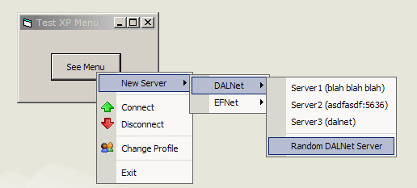



## Office XP Menus \(No OCX\)

### Description

Create Office XP style popup menus without an OCX. Very easy to use.
 
### More Info
 

             |
---                |---
**Submitted On**   |2001-11-28 01:20:48
**By**             |[vcv](https://github.com/Planet-Source-Code/PSCIndex/blob/master/ByAuthor/vcv.md)
**Level**          |Intermediate
**User Rating**    |4.8 (183 globes from 38 users)
**Compatibility**  |VB 5\.0, VB 6\.0
**Category**       |[Graphics](https://github.com/Planet-Source-Code/PSCIndex/blob/master/ByCategory/graphics__1-46.md)
**World**          |[Visual Basic](https://github.com/Planet-Source-Code/PSCIndex/blob/master/ByWorld/visual-basic.md)
**Archive File**   |[Office\_XP\_3802511282001\.zip](https://github.com/Planet-Source-Code/vcv-office-xp-menus-no-ocx__1-29279/archive/master.zip)

